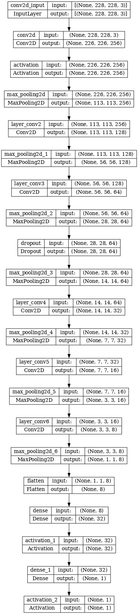
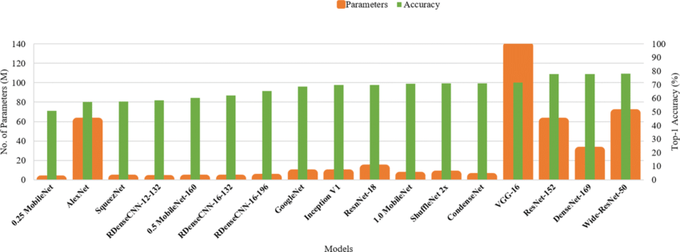

# The Model used here is a prime example why we should use a model with large number or paramters. #

# Model

The model is a Squential Layer Model where the model is not given enough data to train as well the number of parameters are not high as well.
### Size of the Model: ### 4.66 ### MB ### only
So, it is very important that a correct model and a proper dataset is mandatory for everything. ### It is like a answer book without proper points. ###

As we can see from the image that it is very important to find the best model to get the accuracy. A very huge model may not be the ideal one too. So, it is always important to select the model properly.

### Next Question ###

# Can we make it Better? #
We can always with better quality of data and the parameters. 

# Next Plan
1) Check the Same model with a proper dataset to check the accuracy
2) Modify the model with a proper dataset and again check the accuracy

You can contribute too. :)
